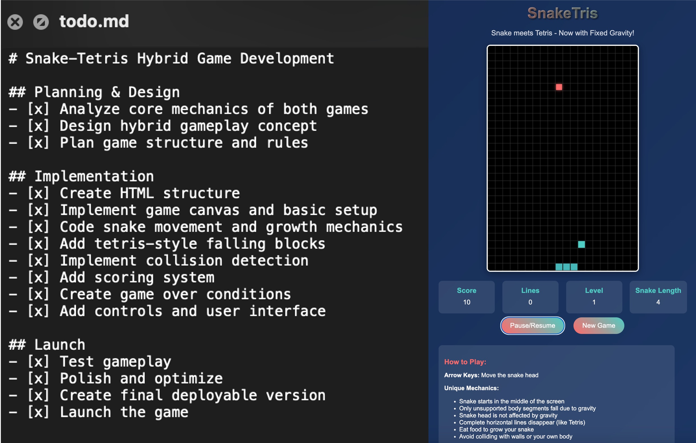

# 🚀 prompts-to-agents: Build Your Local Manus-Like Agents from Scratch with Just One Prompt (No Coding Needed)

## 🎁 What You'll Get

- A clear understanding of how agents like Manus are created.
- The ability to spin up a local agent that can generate `todo.md` and tackle general agent tasks step by step in just 5 minutes.
- Insight into the agent creation process, so you see how things are built rather than sifting through complex codebases.
- A clean project structure with easily modifiable tools and prompts, empowering you to craft your own agent.

---

## 🛠️ Quick Start Steps

### 1. Create Your Project & Prepare Files

Start a new project in your favorite AI Coding IDE (such as Cursor, Windsurf, etc.). Download [system_prompt.txt](./system_prompt.txt) into your project directory.

> _Note: This system prompt is a trimmed version of [Manus Prompt](https://github.com/x1xhlol/system-prompts-and-models-of-ai-tools/blob/main/Manus%20Agent%20Tools%20%26%20Prompt/Modules.txt), with complex parts like deployment, knowledge, and datasource removed for simplicity._

### 2. Set Up Your Environment

The LLM you choose determines your agent's performance. This guide is primarily tested with `claude-4-sonnet-20250514`.

Create an empty `.env` file and add your configuration. Choose the setup that matches your LLM provider:

#### 🟦 Option 1: OpenAI-Style LLM Provider (Recommended)

If you can use an LLM from a provider with an OpenAI-style endpoint, you can use that and later will be using the OpenAI Agent SDK, which is better for further development and testing different models. 

```
OPENAI_API_KEY=your_openai_api_key
OPENAI_BASE_URL=your_custom_end_point_url(https://xxx.com/v1)
OPENAI_MODEL_NAME=claude-sonnet-4-20250514
MAX_TURNS=100
SYSTEM_PROMPT_FILE=system_prompt.txt
```

#### 🟦 Option 2: Use Anthropic Official

If you want to use the Anthropic Official API Key, get it from [Anthropic Console](https://console.anthropic.com/settings/keys) and paste it below

```
ANTHROPIC_API_KEY=your_anthropic_api_key
ANTHROPIC_BASE_URL=https://api.anthropic.com/
ANTHROPIC_MODEL_NAME=claude-sonnet-4-20250514
MAX_TURNS=100
SYSTEM_PROMPT_FILE=system_prompt.txt
```

### 3. Create Your Agent with Prompt

Now copy the prompt to the chatbox of your AI Coding IDE and let the coding agent start creating the project. 
* OpenAI style: [agent_prompt_openai_agents.txt](./agent_prompt_openai_agents.txt).(using [OpenAI Agent SDK](https://github.com/openai/openai-agents-python))
* Anthropic API: [agent_prompt_anthropic.txt](agent_prompt_anthropic.txt) 

At the end, you'll see a project structure like this:
```
├── agent.py
├── tools.py
├── chat.py
├── main.py
├── model_provider.py
├── system_prompt.txt (you-created)
├── requirements.txt
├── .env (you-created)
└── workspace/ 
    └── session_xxxxxxxx_xxxxxx/ (auto-created each chat)
```

It should automatically start the chat interface, or you can manually start the chat agent in the terminal with:
```
source .venv/bin/activate
python main.py
```


You can also use the Anthropic Official API with openai-agents-sdk, but you may need some modifications to the project.

If you encounter any errors, just let the Coding Agent fix the bugs. It might not succeed on the first try, but AI can easily fix bugs in most cases.

Then test your agent with some prompts. Here are some examples and results:
* Think of 2 of your favorite web games, merge their core mechanics into a new game, and then launch it.

    >Result: A snaketris game 😂
    
    

* Search for today's news about popular LLM companies and create a summary report.

    >Result: A report with 2k words [llm_companies_news_summary_report](resources/llm_companies_news_summary_report.md)

## 🚀 What's Next

As you can see, just giving basic file and coding tools to a powerful LLM can already do many things. You can continue to talk with your AI Coding IDE (like Cursor) to make this simple agent more powerful:

* 🔧 **Add Tools**: Read [system-prompts-and-models-of-ai-tools](https://github.com/x1xhlol/system-prompts-and-models-of-ai-tools) and add more tools to `tools.py` like `init_react_project`, `web_search`, `browse_use`.
* 🔌 **Add MCP**: If you used the openai-style prompt, openai-agents-sdk already support llm. Coding LLM may not know the sdk well, so please give [this example](https://openai.github.io/openai-agents-python/mcp/) link to it before modification.
* 💬 **Context and History**: For multi-turn conversations, you may find token overflow as coding is really token-intensive.
* 📝 **Don't forget to update system_prompt.txt**.


## 🌟 Alternative LLM Options

If you have trouble getting Anthropic API or find Claude-4 too expensive for testing, you can try Kimi-K2. Get your key at [Moonshot AI console](https://platform.moonshot.cn/console/api-keys). It may be a bit slow but works well.

**K2 OpenAI Style**

```
OPENAI_API_KEY=your_moonshot_api_key
OPENAI_BASE_URL=https://api.moonshot.cn/v1
OPENAI_MODEL_NAME=kimi-k2-0711-preview
```

**K2 Anthropic Style**
```
ANTHROPIC_API_KEY=your_moonshot_api_key
ANTHROPIC_BASE_URL=https://api.moonshot.cn/anthropic
ANTHROPIC_MODEL_NAME=kimi-k2-0711-preview
```
You can also try GPT-4.1 and Gemini-2.5-Pro. Overall, I find K2 is the most cost-effective option.


## 🗺️ RoadMap
Deliver more prompts to make more useful agents tailored for different use cases.

---

⭐ **Drop a star if you find this useful!** 

